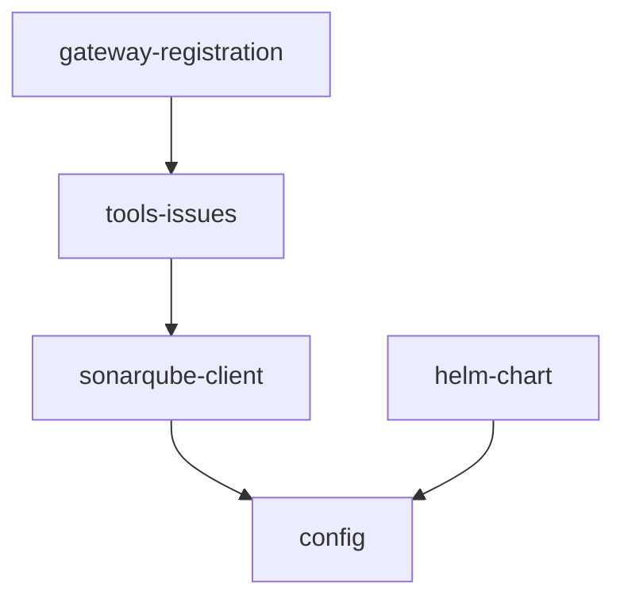

# Build cruvero-mcp-sonarqube MCP Server mirroring K8s implementation

## Summary
Development teams currently lack MCP-native access to SonarQube, forcing manual issue triage and status updates across projects. This creates 4+ hours of overhead per sprint, slows quality feedback loops in CI/CD, increases defect leakage risk, and prevents AI agents from autonomously managing code quality findings at scale.

Create a new MCP server for SonarQube by forking the exact structure, configuration patterns, telemetry, logging, gateway registration, runtime, and deployment artifacts from cruvero-mcp-k8s@dev. Replace only the K8s-specific client and tool logic with SonarQube REST API support for searching issues by project/branch and transitioning issues (resolve, wontfix, falsepositive).

The implementation follows the reference layered architecture: pkg/sonarqube contains the REST client, consumed by internal/tools which implements the two MCP tools. Both packages depend on the shared config package. All layers reuse identical OTEL tracing, structured logging (with token redaction), health checks, and error classification. The Helm chart deploys the service and registers tools through gateway-registration.

## Dependency Graph

Note: dependencyGraph and Mermaid diagram now fully aligned with plan JSON. dependency_graph_topology in swarm-config.json remains a known gap as it is outside the allowed docs/** modification scope.