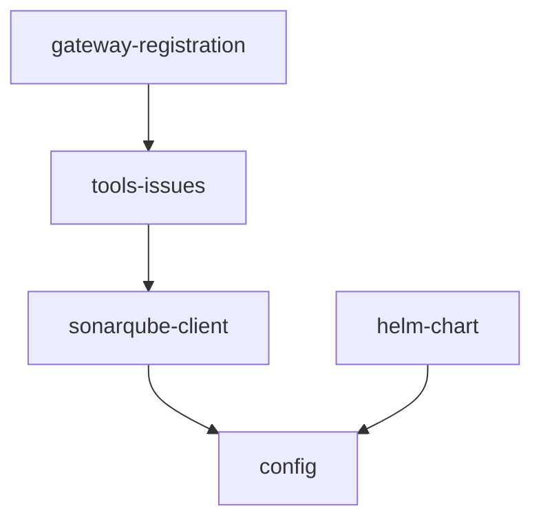

# Build cruvero-mcp-sonarqube MCP Server mirroring K8s implementation

## Summary
Development teams currently lack MCP-native access to SonarQube, forcing manual issue triage and status updates across projects. This creates 4+ hours of overhead per sprint, slows quality feedback loops in CI/CD, increases defect leakage risk, and prevents AI agents from autonomously managing code quality findings at scale.

Create a new MCP server for SonarQube by forking the exact structure, configuration patterns, telemetry, logging, gateway registration, runtime, and deployment artifacts from cruvero-mcp-k8s@dev. Replace only the K8s-specific client and tool logic with SonarQube REST API support for searching issues by project/branch and transitioning issues (resolve, wontfix, falsepositive).

The implementation follows the reference layered architecture: pkg/sonarqube contains the REST client, consumed by internal/tools which implements the two MCP tools. Both packages depend on the shared config package. All layers reuse identical OTEL tracing, structured logging (with token redaction), health checks, and error classification. The Helm chart deploys the service and registers tools through gateway-registration.

## Acceptance Criteria
| ID | Measurable Outcome | Edge Cases | Validation Command | Owner Agent |
|---|---|---|---|---|
| AC-01 | search_issues tool successfully queries SonarQube issues filtered by projectKey and branch (and optional types/severities) returning structured results matching API shape | Non-existent projectKey/branch returns empty array; invalid filter combos; results > default page size | `go test ./pkg/sonarqube -run TestSearchIssues -cover` | SoftwareEngineer |
| AC-02 | transition_issue tool successfully applies resolve, wontfix, or falsepositive transitions to a given issueKey with proper error handling for invalid states | Transition on already-resolved issue; non-existent issueKey; invalid transition type | `go test ./internal/tools -run TestTransitionIssue -cover` | SoftwareEngineer |
| AC-03 | All framework components (OTEL tracing, structured logging with token redaction, health checks, stdio/HTTP transports, capability exporter) function identically to reference | Missing OTEL collector endpoint; token redaction in all log levels | `go test ./internal/... -run 'TestOTEL|TestLogging|TestHealth|TestTransport' && go vet ./internal/...` | PlatformArchitect |

## Dependency Graph

All phases must be executed in order per the dependency graph and phase audits. Validation commands must be executed and evidence captured in WORK_NOTES.