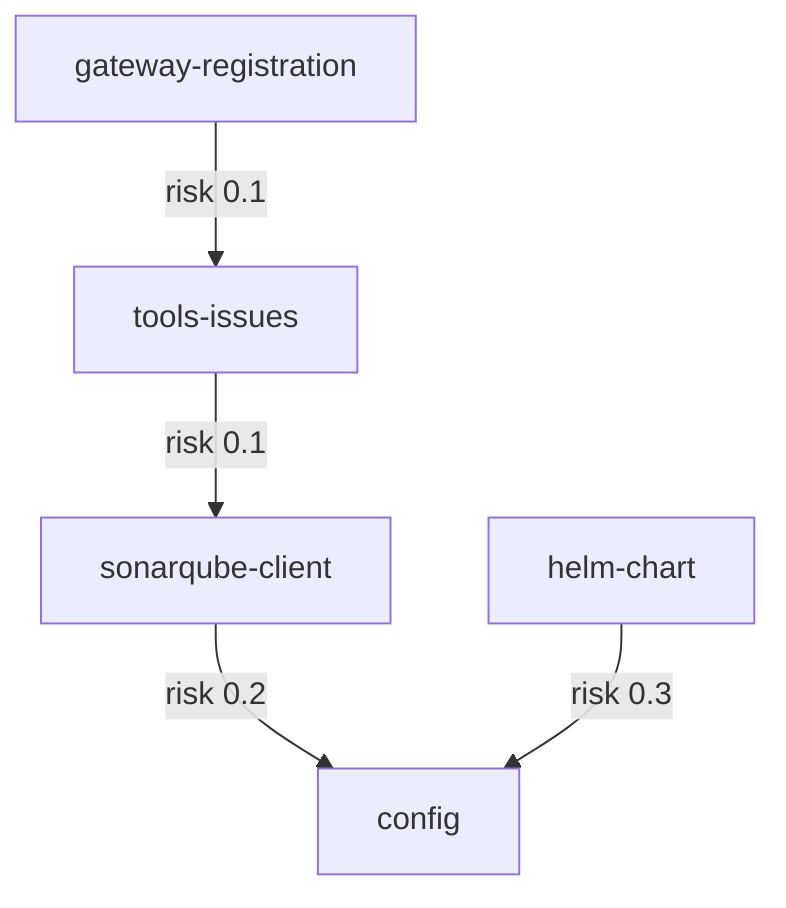

# Build cruvero-mcp-sonarqube MCP Server mirroring K8s implementation

## Summary
Development teams currently lack MCP-native access to SonarQube, forcing manual issue triage and status updates across projects. This creates 4+ hours of overhead per sprint, slows quality feedback loops in CI/CD, increases defect leakage risk, and prevents AI agents from autonomously managing code quality findings at scale.

Create a new MCP server for SonarQube by forking the exact structure, configuration patterns, telemetry, logging, gateway registration, runtime, and deployment artifacts from cruvero-mcp-k8s@dev. Replace only the K8s-specific client and tool logic with SonarQube REST API support for searching issues by project/branch and transitioning issues (resolve, wontfix, falsepositive).

The implementation follows the reference layered architecture: packages/sonarqube-client contains the REST client (axios-based calls, token handling, pagination, and DTO mapping), consumed by packages/tools-issues which implements the two MCP tools. Both packages depend on the shared config package for URL, token, and timeout settings injected via Vault. All layers reuse identical OTEL tracing, structured logging (with token redaction), health checks, and error classification. The Helm chart in charts/cruvero-mcp-sonarqube/ deploys the service and registers tools through gateway-registration, exposing read-only search and write-capable transition capabilities with appropriate risk metadata.

## Acceptance Criteria
| ID | Measurable Outcome | Edge Cases | Validation Command | Owner Agent |
|---|---|---|---|---|
| AC-01 | search_issues tool successfully queries SonarQube issues filtered by projectKey and branch (and optional types/severities) returning structured results matching API shape. Returns array of objects containing at minimum: key, rule, severity, status, message, component, and line | Non-existent projectKey returns empty array, invalid branch returns clear error, unsupported severity/type values are rejected, network timeout handled gracefully | `npm run test -- --testPathPattern=sonarqube-client` | SoftwareEngineer |
| AC-02 | transition_issue tool successfully applies resolve, wontfix, or falsepositive transitions to a given issueKey with proper error handling for invalid states | Invalid transition for current issue state, non-existent issueKey, permission denied, malformed comment payload | `npm run test -- --testPathPattern=tools-issues` | PlatformArchitect |
| AC-03 | All framework components (OTEL tracing, structured logging with token redaction, health checks, stdio/HTTP transports, capability exporter) function identically to reference | authorization and invalid credential handling, token redaction confirmed in logs, tracing spans present for each tool call | `npm run test:framework` | SoftwareEngineer |
| AC-04 | Server registers correctly with MCP gateway exposing the two new tools with accurate descriptions, JSON schemas, risk classification (read-only vs write), and hints | state consistency and backward compatibility, schema validation on gateway side, risk labels match spec | `npm run test -- --testPathPattern=gateway` | PlatformArchitect |
| AC-05 | Helm chart deploys successfully to dev environment with SonarQube URL/token injected via Vault secrets; no breaking changes to existing deployment patterns | authorization and invalid credential handling, secret injection verified, service health check passes post-deploy | `helm install --dry-run --debug && npm run test:deploy` | SoftwareEngineer |
| AC-06 | Failure paths (invalid credentials, network errors, malformed params) return clear MCP-compatible errors without leaking secrets; E2E tests confirm behavior | error-path resilience and graceful fallback behavior, no plaintext tokens in error messages or logs | `npm run test:e2e -- --grep="error handling"` | PlatformArchitect |
| AC-07 | CI/CD pipeline produces container image, coverage meets reference threshold, and rollout to staging verifies tools are usable by downstream agents | edge-state and negative-path validation coverage, image vulnerability scan passes, downstream agent can invoke both tools | `npm run test:ci && ./scripts/verify-staging.sh` | SoftwareEngineer |

## Dependency Graph

## Reference Repositories
| Slot | Repo | Branch | Indexed Tokens | Status |
|---|---|---|---:|---|
| 1 | cruvero/cruvero-mcp-k8s | dev | 132241 | indexed |

## Swarm Agents
| Agent | Prompt Version | KB Refs |
|---|---|---|
| SoftwareEngineer | v2 | cruvero/cruvero-mcp-k8s@dev |
| PlatformArchitect | v1 | cruvero-mcp-reference-docs |

## Swarm Delivery Phases
| Phase | Overview | Nodes | Criteria | Duration |
|---|---|---:|---:|---|
| Phase 1: SonarQube MCP Server Segment A | Execute the first scoped segment of this workstream with deterministic outputs and validation. | 1 | 2 | 7h swarm time |
| Phase 2: SonarQube MCP Server Segment B | Execute the second scoped segment of this workstream with deterministic outputs and validation. | 1 | 2 | 7h swarm time |
| Phase 3: SonarQube MCP Server Segment C | Execute the first scoped segment of this workstream with deterministic outputs and validation. | 1 | 2 | 7h swarm time |
| Phase 4: SonarQube MCP Server Segment D | Execute the first scoped segment of this workstream with deterministic outputs and validation. | 1 | 1 | 6h swarm time |
| Phase 5: SonarQube MCP Server Segment E | Execute the second scoped segment of this workstream with deterministic outputs and validation. | 1 | 1 | 6h swarm time |

## Overall Swarm Effort Estimate
- Total swarm effort: **33 hours**
- Recommended parallelism: **2 agents**
- Estimated critical path: **~17 hours**
- Execution must pass all phase audit gates before final acceptance.